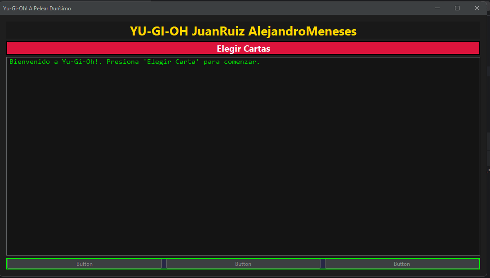
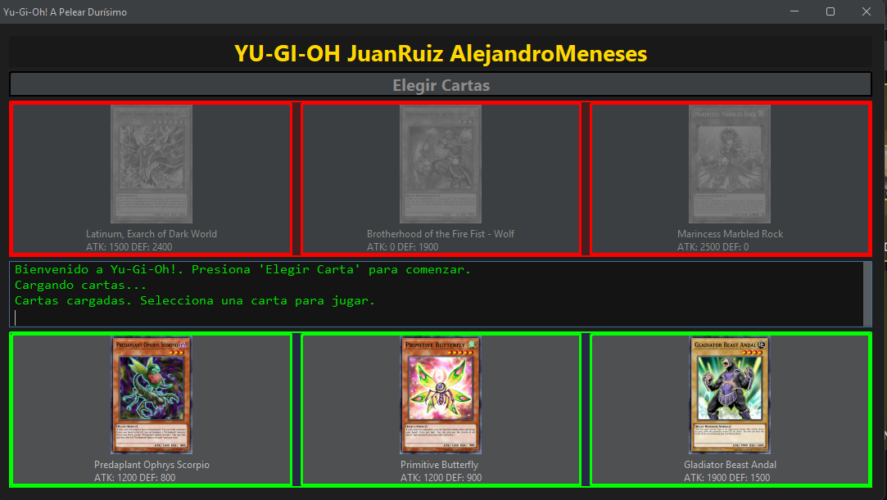
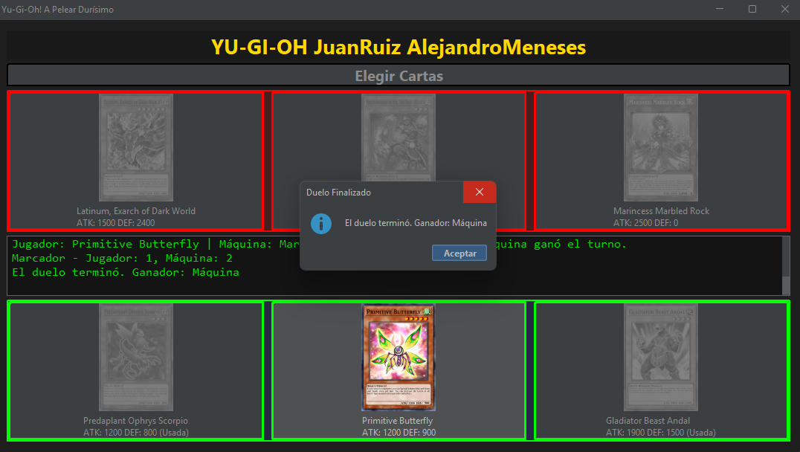
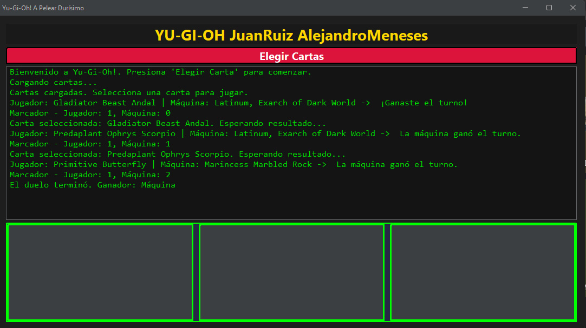

# Yugioh 
---
## Miembros
---
#### JUAN FELIPE RUIZ LOPEZ  2359397 - 3743
#### JUAN ALEJANDRO MENESES DE LA TORRE  2359303 - 2724

### Aquí puedes jugar un duelo simple contra la máquina.

##  Cómo iniciar
1. abre la clase de Stadium.java, dale al iniciador para que se te abra la ventana del juego
2. Presiona el boton **Iniciar Duelo**.
3. Selecciona una carta tendras 3 opciones a escoger.
4. Mira el resultado final y juega de nuevo si deseas

### El diseño de este proyecto se basa en una interfaz sencilla y clara que permite al jugador interactuar fácilmente con las cartas y el flujo del duelo.
### La estructura está pensada para mostrar de forma ordenada la selección de cartas, el resultado de cada turno y el marcador, logrando una experiencia visual amigable sin sobrecargar al usuario.

### A nivel de código, se sigue una organización modular en la que las clases se dividen según su responsabilidad (cartas, lógica del duelo, interfaz). Esto favorece la mantenibilidad y facilita futuras ampliaciones, 
### como agregar nuevas cartas o mejorar la interfaz gráfica.

